# Procesverslag
Markdown is een simpele manier om HTML te schrijven.  
Markdown cheat cheet: [Hulp bij het schrijven van Markdown](https://github.com/adam-p/markdown-here/wiki/Markdown-Cheatsheet).

Nb. De standaardstructuur en de spartaanse opmaak van de README.md zijn helemaal prima. Het gaat om de inhoud van je procesverslag. Besteedt de tijd voor pracht en praal aan je website.

Nb. Door *open* toe te voegen aan een *details* element kun je deze standaard open zetten. Fijn om dat steeds voor de relevante stuk(ken) te doen.

## Jij

  
uitwerken voor kick-off werkgroep

  ### Auteur:
  Rhania Lachman 

  #### Je startniveau:
  Blauw (kies uit zwart, rood óf blauw)

  #### Je focus:
  extra aandacht voor de website surface plane verbeteren 
  (kies uit responsive óf surface plane)
 

## Je website

  
uitwerken voor kick-off werkgroep

  ### Je opdracht:
  link naar de website die je gaat namaken óf de naam/omschrijving van je eigen ontwerp
  https://www.glossier.com

  #### Screenshot(s) van de eerste pagina (small screen): 
  De Homepagina
  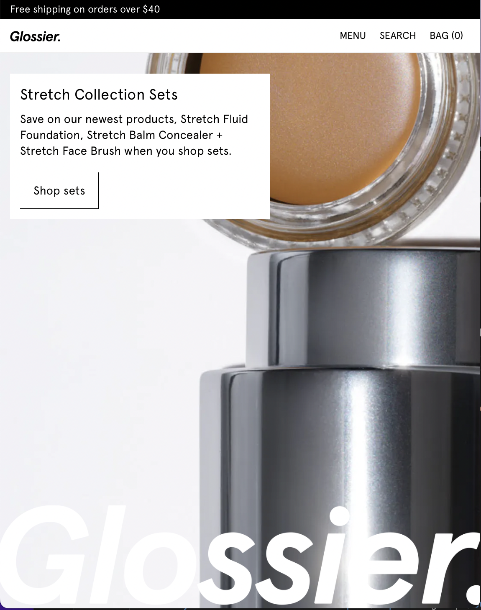

  #### Screenshot(s) van de tweede pagina (small screen):
  De Detailpagina 
  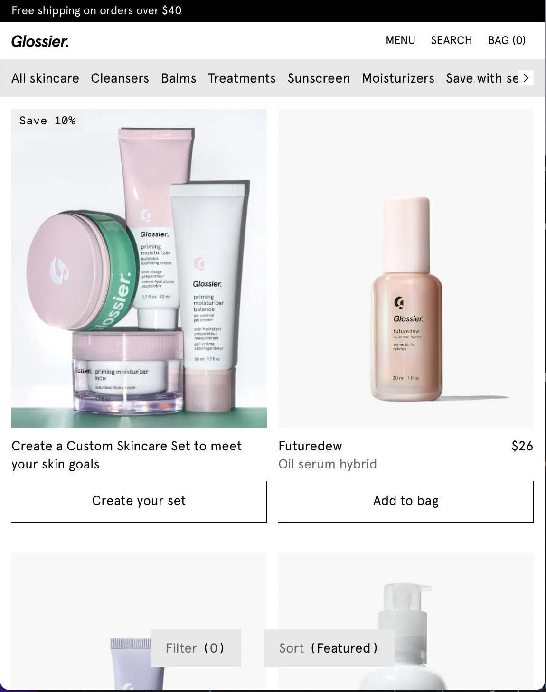
Onderverdelen
 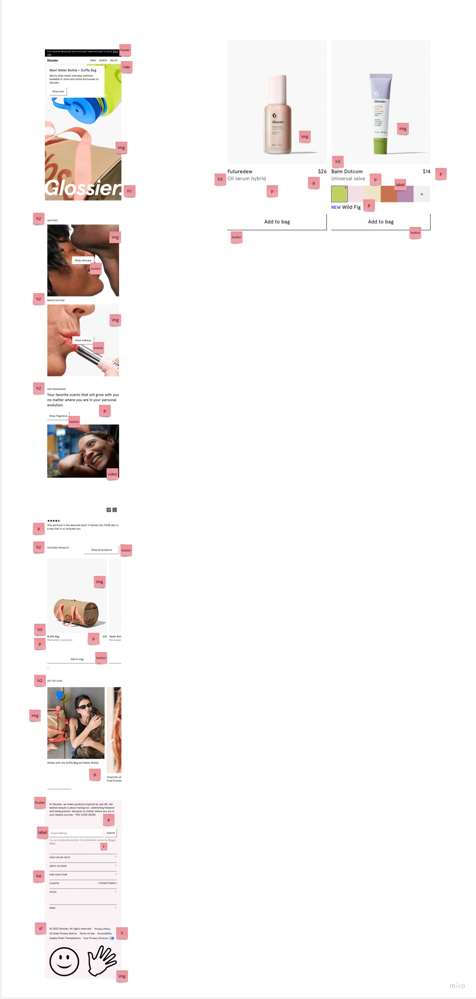

## Toegankelijkheidstest 1/2 (week 1)

  
uitwerken na test in 2e werkgroep

  ### Bevindingen
  -Informatieve knoppen missen in de orginele 
  -h1 mist in de orginele site, wel zitten er h2 en h3 in
  -De video staat op autoplay in de originele 
  -Img onderaan de pagina is een link, maar lijkt niet op een link.

  :

## Breakdownschets (week 1)

  
uitwerken na afloop 3e werkgroep

  ### de hele pagina: 
  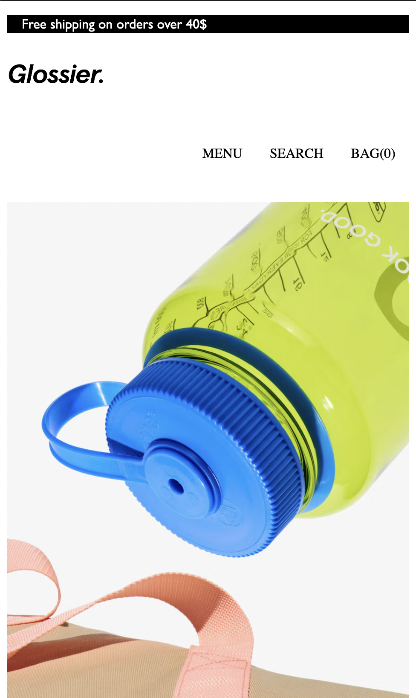

  ### dynamisch deel (bijv menu): 
  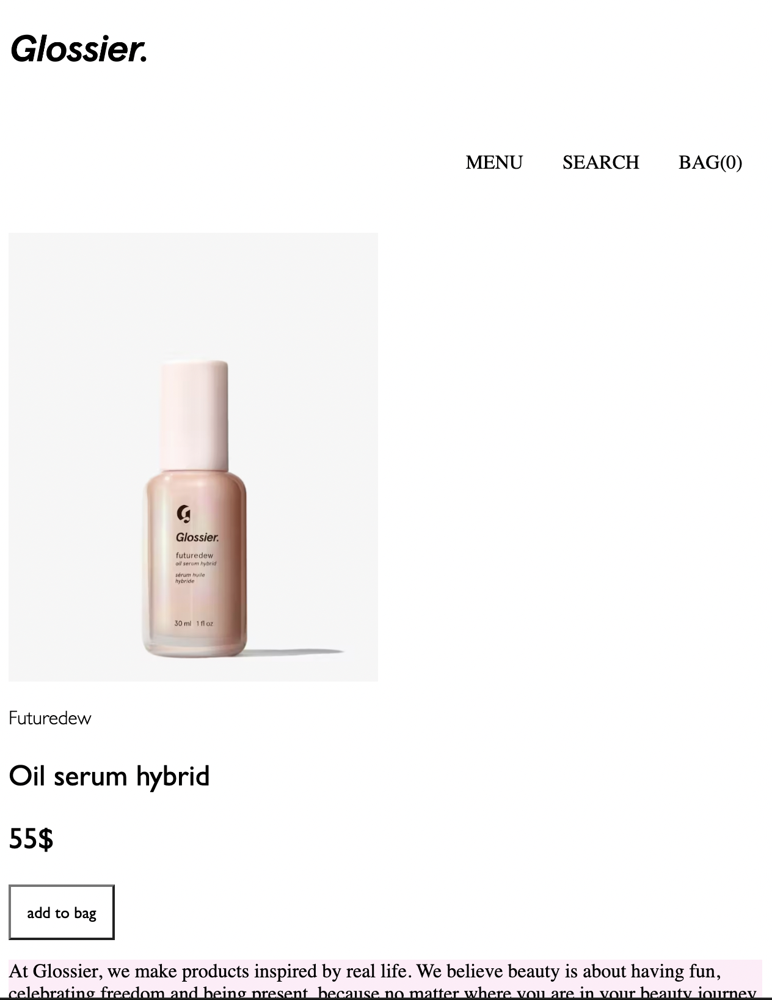

## Voortgang 1 (week 2)

  
uitwerken voor 1e voortgang

  ### Stand van zaken
  hier dit ging goed & dit was lastig (neem ook screenshots op van delen van je website en code)
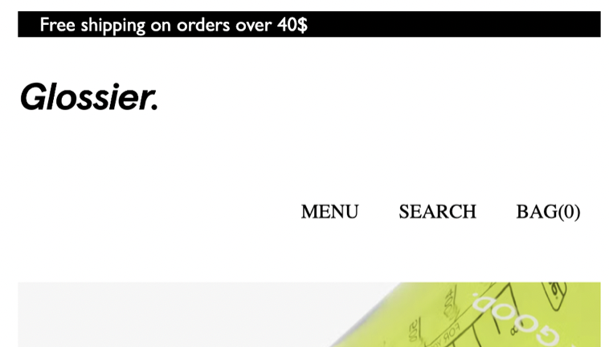
Het logo moest naar de navigatie komen te staan, ook moest dit kunnen meeschalen. Dit lukte me niet maar met hulp ging dit beter. 

  ### Agenda voor meeting
  samen met je groepje opstellen

  | Elles     | Rhania          | Sophie    | Amber        |
  | ---            | ---                | ---          | ---              |
  | Logo centreren. | Flexbox| Flexbox| Tekst  schalen 
  Grid | Grid             | Grid    | Flexbox   |
  | Meeschalen | Tekst+ afbeelding | Tekst+ afbeelding |  Afbeelding schalen |
  

  ### Verslag van meeting
  hier na afloop snel de uitkomsten van de meeting vastleggen

  - Wat het verschil is tussen een article en section
  - Wat het verschil is tussen een link en een button
  - Dingen kunnen uitlijnen door middel van flexbox
  - CSS selectors 

## Voortgang 2 (week 3)

  
uitwerken voor 2e voortgang

  ### Stand van zaken
  hier dit ging goed & dit was lastig (neem ook screenshots op van delen van je website en code)

  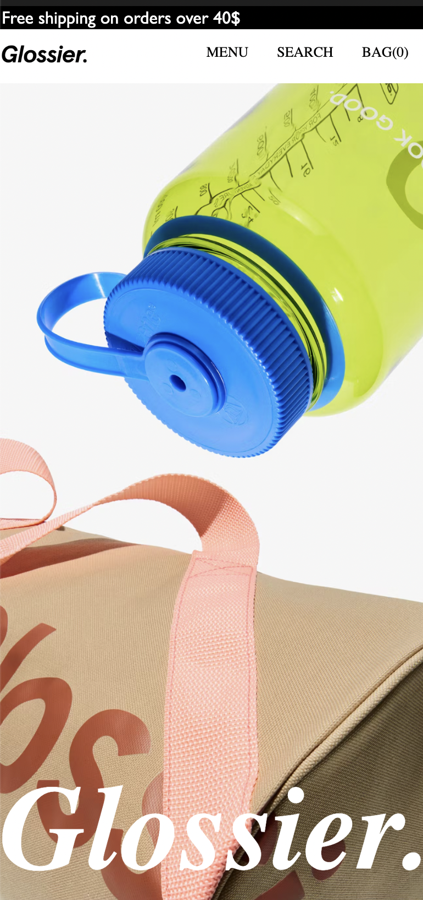

  Mijn beginpagina is klaar, alleen moet ik hem nog responsive maken. 
  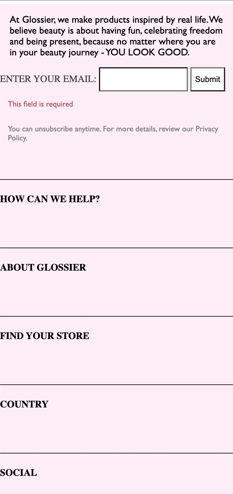

  Ik heb alle content in de footer gezet en geprobeerd alles goed te positioneren. Ik moet hier wel nog verder aan werken.

  ### Agenda voor meeting
  samen met je groepje opstellen

  | Elles      | Rhania          | Sophie    | Amber        |
  | ---            | ---                | ---          | ---              |
  | Linkjes die nergens heen linken | Responsive              | Responsive    | Knoppen centreren    |
  | Hoe update je Github? | Foto's meeschalen | En uitklap menu maken | Carrousel vereenvoudigen |
  | Schalen met % of em?            | Schalen met % of em?                | ...          | ...              |

  ### Verslag van meeting
  hier na afloop snel de uitkomsten van de meeting vastleggen

  - Hoe je afbeelding mee kan schalen met het scherm 
  - Hoe je knoppen centreren 
  - Flexbox meer uitgeleged 
- ...

## Toegankelijkheidstest 2/2 (week 4)

  
uitwerken na test in 9e werkgroep

  ### Bevindingen
  -Je mag geen button en link samen, dit hoort apart van elkaar
  -Horizontale scroll moet weg voor je mobiele scherm.
  -Images moeten een alt text bevatten 

## Voortgang 3 (week 4)

  
uitwerken voor 3e voortgang

  ### Stand van zaken
 - De tweede pagina maken ging met grid 
 - Ik heb uiteindelijk gekozen voor surface plane in plaats van responsive 

 

  ### Agenda voor meeting
  samen met je groepje opstellen

  | Elles      | Amber         | Rhania    | Sophie        |
  | ---            | ---                | ---          | ---              |
  | Responsive met margin  | px gebruiken en em            | px gebruiken   | Responsive|
  | media queries | nth-of-type | nth-of-type | hover |
  | ...            | ...                | ...          | ...              |

  ### Verslag van meeting
  hier na afloop snel de uitkomsten van de meeting vastleggen

  - Keyframes gebruiken 
  - Responsive 
  - Hover gebruiken met kleur 
  - ...

## Eindgesprek (week 5)

  
uitwerken voor eindgesprek

  ### Je uitkomst - karakteristiek screenshots:
  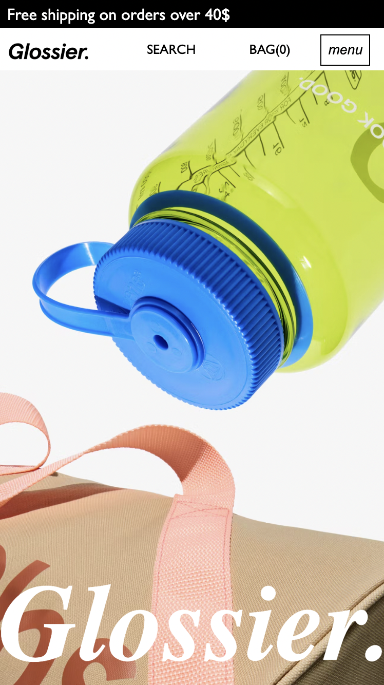
Het eerste scherm was responsive en er staat een animatie op. 

  ### Dit ging goed/Heb ik geleerd: 
  Korte omschrijving met plaatjes

  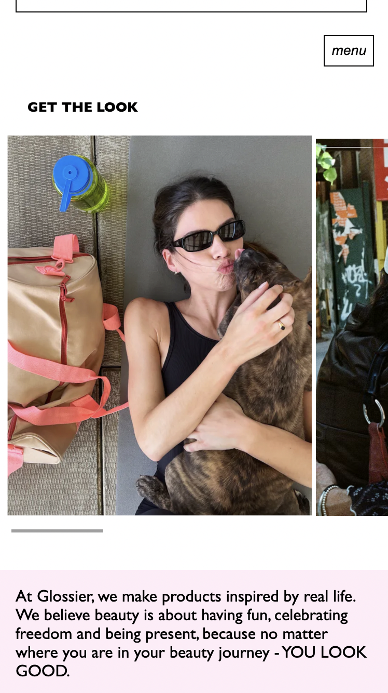
  Ik heb gebruik gemaakt van figure 
  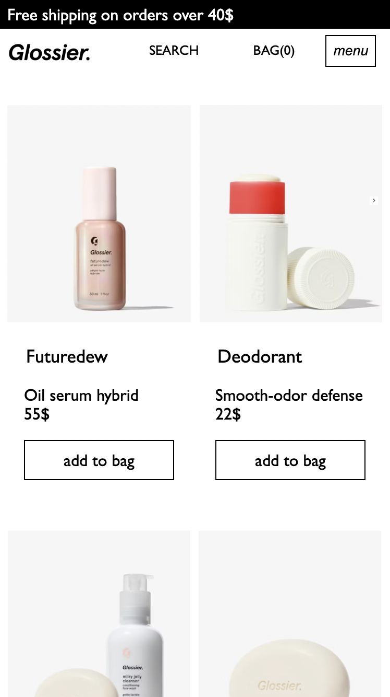
  Ik heb geleerd hoe je met grid werkt.

  ### Dit was lastig/Is niet gelukt:
  Korte omschrijving met plaatjes

  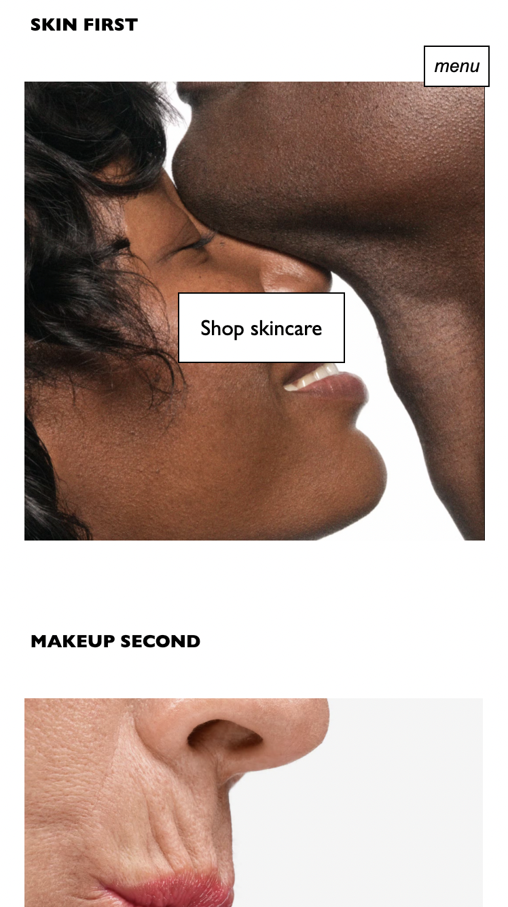
  dit was heel lastig responsive te maken dus, dit is niet gelukt

## Bronnenlijst

  
continu bijhouden terwijl je werkt

  Nb. Wees specifiek ('css-tricks' als bron is bijv. niet specifiek genoeg). 
  Nb. ChatGpT en andere AI horen er ook bij.
  Nb. Vermeld de bronnen ook in je code.

  1. https://www.glossier.com
  2. https://codepen.io/trending
  3. https://chat.openai.com/auth/login?next=%2F%3Fmodel%3Dtext-davinci-002-render-sha
  4.https://www.w3schools.com/tags/tag_figure.asp  

